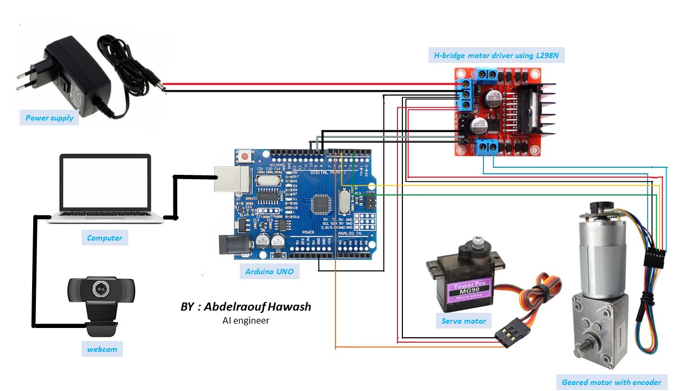

# fruit classification machine
this system used for fruit classification Based on fruit type or fruit quality and other upon selected trained model


## Hardware



* you can get hardware conponents from [here](media/components.csv)
* we used arduino uno.
* webcam
* servo motor
* geared motor

## software


* [HW_controller](arduino/HW_controller/HW_controller.ino): on arduino that send hardware state to PC and does what PC tells it to do through the serial. It use PID control to reach the speed goal.

* [main](programs/main.py) script, is running on PC and tells arduino what to do with a GUI

* you can biuld your model from this script "[build_model](programes/dataset&buildingModel/build_model.ipynb)".

## How to use

* upload [arduino](arduino/HW_controller/HW_controller.ino) code on arduino using arduino IDE.
* install python3 on your system
* install some libraries.
```
pip install opencv-python
pip install tk
pip install Pillow
pip install pyserial
pip install tensorflow
```
* run [main](programs/main.py) script:
```
python3 main.py
```
